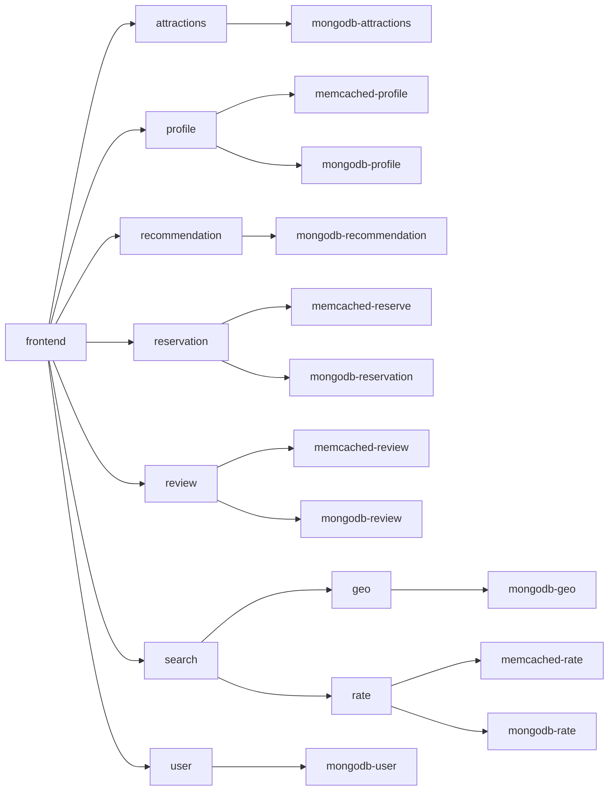

# Hotel Reservation dependency map

```mermaid
graph LR
  attractions[attractions] --> mongodb_attractions[mongodb-attractions]
  frontend[frontend] --> attractions[attractions]
  frontend[frontend] --> profile[profile]
  frontend[frontend] --> recommendation[recommendation]
  frontend[frontend] --> reservation[reservation]
  frontend[frontend] --> review[review]
  frontend[frontend] --> search[search]
  frontend[frontend] --> user[user]
  geo[geo] --> mongodb_geo[mongodb-geo]
  profile[profile] --> memcached_profile[memcached-profile]
  profile[profile] --> mongodb_profile[mongodb-profile]
  rate[rate] --> memcached_rate[memcached-rate]
  rate[rate] --> mongodb_rate[mongodb-rate]
  recommendation[recommendation] --> mongodb_recommendation[mongodb-recommendation]
  reservation[reservation] --> memcached_reserve[memcached-reserve]
  reservation[reservation] --> mongodb_reservation[mongodb-reservation]
  review[review] --> memcached_review[memcached-review]
  review[review] --> mongodb_review[mongodb-review]
  search[search] --> geo[geo]
  search[search] --> rate[rate]
  user[user] --> mongodb_user[mongodb-user]
```

All Go services also depend on `consul` for service discovery.
